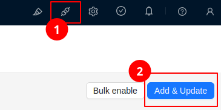
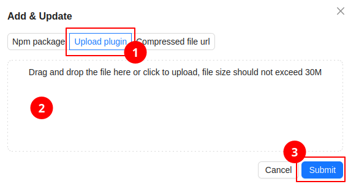
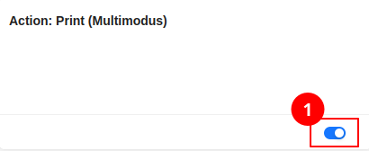
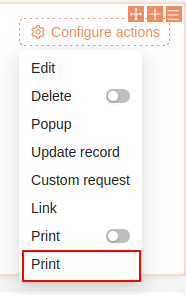
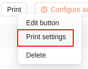
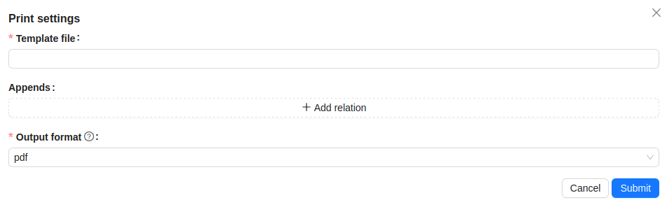
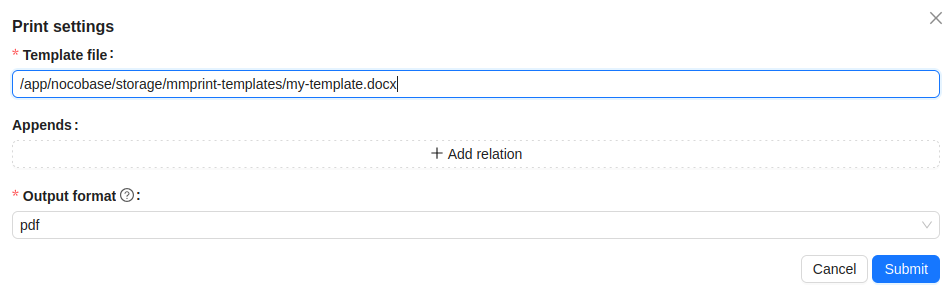
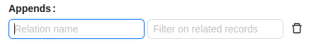

# Generate templated documents using Carbone.io

This plugin allows you to generate docx, xlsx or pdf documents from the currently displayed record. Carbone.io templating engine is used in the backend to generate the documents.

## Setup

The simplest way to set up this plugin is with Nocobase running in docker. In your `docker-compose.yml`:

1. Configure the Carbone host as an env var for the nocobase container:
    ```
    services:
    app:
        image: nocobase/nocobase:1.6.3
        environment:
        # ^^^ everything above this line you already have in your docker-compose.yml
        # vvv Add to your docker-compose.yml the lines below
        # carbone url
        - CARBONE_BASE=http://carbone:4000/
    ```

2. add Carbone as a container:

    ```
    carbone:
        image: carbone/carbone-ee:full-fonts
        restart: always
        networks:
        - nocobase
        ports:
        - "4000:4000"
    ```

3. Restart your docker-compose.
4. Install the plugin on the nocobase plugins page (1) -> Add & Update (2)

    

1. Upload the tar release file downloaded from github

    
    Select the "Upload plugin" option, drop the tar file into the Upload drop zone (2) and click Submit (3)

2. Enable the plugin

    
    Push the toggle to the right to make it look like in the screenshot.

## Using the pluging

Start the design mode and open a record page where you want to have the Print button. In the form/detail block add the `Print` action.


Note that the other Print action with the toggle is a built-in action.

Configure the button by opening its Print settings modal:



The modal:



The first thing is to enter the path to the template file. Templates can be in `odt` (Open Office Text), `docx` (MS Word), `ods` (Open Office Sheet), `xlsx` (MS Excel) format. For any of these, output can be pdf, or the format matching the input. You can't have a docx template and output to xlsx.

You must make the template file available and reachable to the plugin. If you're running Nocobase using docker, your directory structure will look like this:
```
├── my-nocobase-directory/
  ├── docker-compose.yml
  ├── storage/
```
Add a location under `storage` to hold your template files, so the dir structure looks like this:
```
├── my-nocobase-directory/
  ├── docker-compose.yml
  ├── storage/
    ├── mmprint-templates/
```
Now upload your template file to mmprint-templates. The path to the file will look differently to the plugin because it has the perspective from inside the docker container. E.g.
```
├── my-nocobase-directory/
  ├── docker-compose.yml
  ├── storage/
    ├── mmprint-templates/
      ├── my-template.docx
```
The path for the plugin will be `/app/nocobase/storage/mmprint-templates/my-template.docx`.


Appends allow you to make related records available to the template.

On the Relation name type in the Association's Field name (not the display name) that you want to use for rendering.
For `One to many` relations, if you don't want to include all related records, you can specify a filter. Records will be filtered using the [filterex](https://github.com/cshaa/filtrex/) library.

Example filter you can use:
```
order_line_status == "shipped"
```
Here, `order_line_status` is a field on the associated record. The filter will be evaluated on each record in the association collection.

Documentation on creating templates is available on the [Carbone.io](https://carbone.io/documentation/design/overview/getting-started.html) site. Your data will be available under the `currentRecord` field. So a merge field in the template will look like this: `{d.currentRecord.name}`

